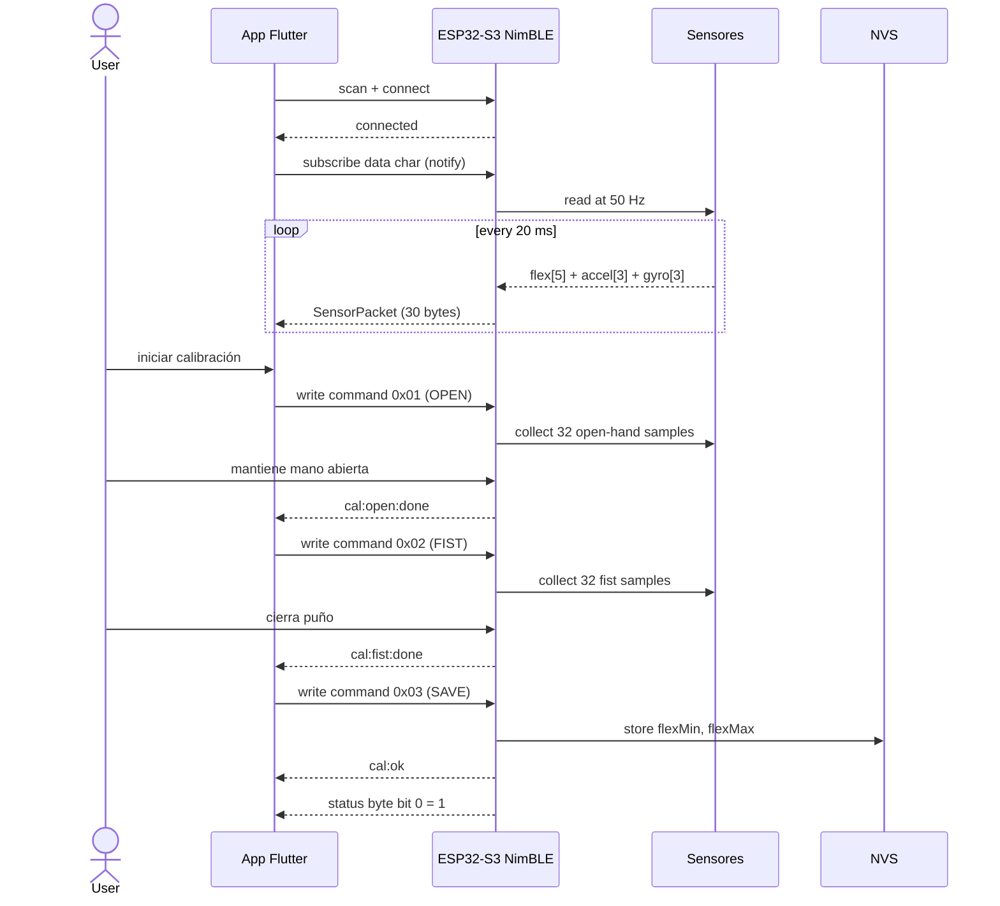

# Diagrama de secuencia — Calibración + streaming

```mermaid
sequenceDiagram
    actor User
    participant App as App Flutter
    participant BLE as ESP32-S3 NimBLE
    participant Sensors as Sensores
    participant NVS as NVS

    App->>BLE: scan + connect
    BLE-->>App: connected
    App->>BLE: subscribe data char (notify)
    BLE->>Sensors: read at 50 Hz
    loop every 20 ms
        Sensors-->>BLE: flex[5] + accel[3] + gyro[3]
        BLE-->>App: SensorPacket (30 bytes)
    end

    User->>App: iniciar calibración
    App->>BLE: write command 0x01 (OPEN)
    BLE->>Sensors: collect 32 open-hand samples
    User->>BLE: mantiene mano abierta
    BLE-->>App: cal:open:done

    App->>BLE: write command 0x02 (FIST)
    BLE->>Sensors: collect 32 fist samples
    User->>BLE: cierra puño
    BLE-->>App: cal:fist:done

    App->>BLE: write command 0x03 (SAVE)
    BLE->>NVS: store flexMin, flexMax
    BLE-->>App: cal:ok
    BLE-->>App: status byte bit 0 = 1
```
